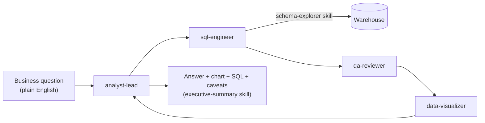

# AI Data Analyst with Claude Code

An agentic analytics system, built entirely out of Claude Code agents and skills
(markdown, no custom app code required to run it), that acts like a small analytics
team: ask a business question in plain English, get back a plain-English answer
backed by real SQL, a chart, and a QA pass — in minutes instead of hours.

This is the natural next step from [Credit-Risk-Portfolio-Analytics](https://github.com/rithikahaha/Credit-Risk-Portfolio-Analytics),
a static Power BI dashboard: instead of pre-building a fixed set of visuals, an
analyst team of agents figures out *how* to answer whatever question is actually
asked, on demand.

## How it works



- **`.claude/agents/`** — the team: `analyst-lead` (orchestrates), `sql-engineer`
  (schema lookup + query writing), `qa-reviewer` (sanity-checks before anything is
  presented as fact), `data-visualizer` (picks the right chart).
- **`.claude/skills/`** — reusable analysis playbooks the agents follow:
  `schema-explorer`, `revenue-trend-analysis`, `cohort-retention`,
  `funnel-analysis`, `anomaly-detection`, `executive-summary`.
- **`connectors/warehouse.py`** — one place all SQL goes through. Read-only by
  construction (rejects anything that isn't `SELECT`/`WITH`/`EXPLAIN`). Defaults to
  a local SQLite sample warehouse; point `DATABASE_URL` at Postgres/Snowflake/
  BigQuery to run against a real one with no agent/skill changes.

## Quickstart

```bash
pip install -r requirements.txt
python scripts/seed_sample_data.py
```

This generates a realistic sample warehouse (`data/sample_warehouse.db`) modeling a
small subscription e-commerce business over ~2.5 years: customers, orders,
subscriptions (for churn/retention), and signup→activation→purchase funnel events —
enough to exercise every skill above with no external credentials.

Then open this repo in Claude Code and ask a business question, e.g.:

- "How has revenue been trending over the last few months?"
- "Which customer segment has the worst subscription churn?"
- "Where in the signup-to-purchase funnel are we losing the most customers?"

See [`examples/example_qna.md`](examples/example_qna.md) for a real run end-to-end,
including the chart and SQL it produced.

## Connecting a real warehouse

Copy `.env.example` to `.env` and set `DATABASE_URL` to your warehouse's SQLAlchemy
connection string (Postgres, Snowflake, BigQuery, etc. — see comments in the file).
Nothing else changes: every agent and skill talks to the warehouse only through
`connectors/warehouse.py`.

## Why agents + skills instead of a fixed dashboard

A BI dashboard answers the questions it was built to answer. This system is built to
answer the question that actually gets asked — including follow-ups ("okay, now
break that down by region") — by having a small team of specialized agents that know
*how to investigate*, not just a fixed set of charts. The tradeoff: it needs
guardrails (read-only queries, mandatory QA pass, explicit caveats) so that
flexibility doesn't come at the cost of trustworthy numbers — see the "Ground rules
for agents" in [`CLAUDE.md`](CLAUDE.md).

## License

MIT
