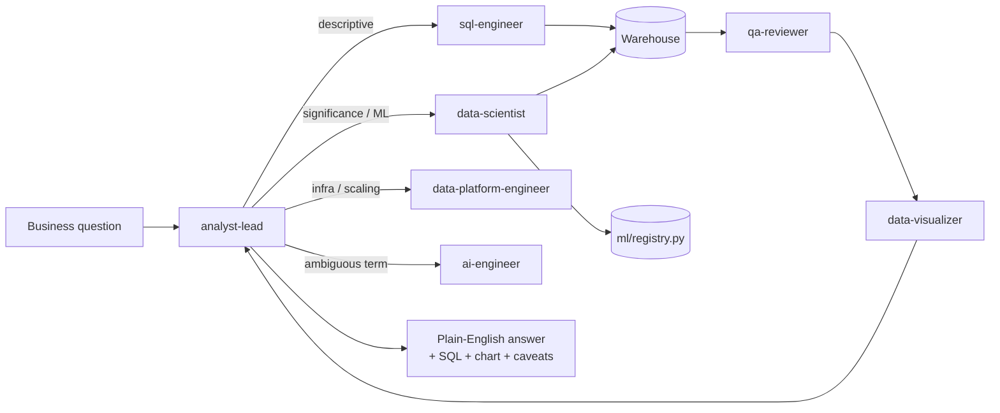

# AI Data Analyst with Claude Code

An agentic analytics system, built on Claude Code agents and skills (markdown, no
separate app required to run the core system), that acts like a full data team:
ask a business question in plain English, get back a plain-English answer backed
by real SQL, statistics, a model, or a chart — in minutes instead of hours.

This is the natural next step from [Credit-Risk-Portfolio-Analytics](https://github.com/rithikahaha/Credit-Risk-Portfolio-Analytics),
a static Power BI dashboard: instead of pre-building a fixed set of visuals, a team
of agents figures out *how* to answer whatever question is actually asked — and this
version covers the full breadth a data analyst is expected to own in 2026: SQL,
statistics, A/B testing, ML, MLOps, data engineering, cloud, dashboards, and
LLM/RAG, not just descriptive reporting.

## The team

Modeled on how an actual product-company data org is staffed — one agent per real
role, not one per individual skill — so responsibilities don't overlap:

| Agent | Role | Owns |
|---|---|---|
| [`analyst-lead`](.claude/agents/analyst-lead.md) | Analytics lead | Orchestration, routing, plain-English synthesis |
| [`sql-engineer`](.claude/agents/sql-engineer.md) | Data Analyst (SQL) | Schema discovery, query writing |
| [`data-scientist`](.claude/agents/data-scientist.md) | Data Scientist | Statistics, A/B test readouts, predictive modeling |
| [`ml-platform-engineer`](.claude/agents/ml-platform-engineer.md) | ML Engineer / MLOps | Model registry, drift detection, retraining triggers |
| [`data-platform-engineer`](.claude/agents/data-platform-engineer.md) | Data/Platform Engineer | Pipelines, data quality, cloud infra, system design |
| [`data-visualizer`](.claude/agents/data-visualizer.md) | BI Developer | Ad-hoc charts + the standing dashboard |
| [`ai-engineer`](.claude/agents/ai-engineer.md) | AI Engineer | RAG-grounded definitions, agent/skill quality bar |
| [`qa-reviewer`](.claude/agents/qa-reviewer.md) | Data Quality / Production readiness | Per-query QA, test suite, CI |

`.claude/skills/` holds the reusable playbooks these agents follow: schema
exploration, revenue trend analysis, cohort retention, funnel analysis, anomaly
detection, and executive-summary formatting.

## How it works



- **`connectors/warehouse.py`** — the one place all SQL goes through. Read-only by
  construction (rejects anything but `SELECT`/`WITH`/`EXPLAIN`). Defaults to the
  local sample warehouse; point `DATABASE_URL` at Postgres/Snowflake/BigQuery to
  run against a real one with no agent/skill changes — see
  [`docs/cloud-deployment.md`](docs/cloud-deployment.md).
- **`pipelines/`** — the data engineering layer: `scripts/export_raw_sources.py`
  simulates raw source-system extracts, `pipelines/etl.py` transforms and loads
  them with `pipelines/data_quality.py` checks on both sides of the transform.
- **`stats/` + `experiments/`** — significance testing (t-test, chi-square,
  confidence intervals) and A/B test readouts (sample-size calculation,
  two-proportion z-test, guardrail checks).
- **`ml/`** — a churn-risk model (`train_churn_model.py`), an append-only model
  registry (`registry.py`), and drift detection against the training-time feature
  snapshot (`check_drift.py`).
- **`dashboard/`** — a live Streamlit app (`app.py`) and a companion published
  Artifact (static HTML + a precomputed `metrics.json`) for shareable, no-server
  viewing.
- **`rag/` + `knowledge/`** — TF-IDF retrieval (no external API key needed) over
  `knowledge/metrics_glossary.md`, so an agent grounds an ambiguous term
  ("active customer," "churn," "revenue") in a citable definition instead of
  guessing.
- **`infra/` + `docs/`** — illustrative Terraform for AWS/GCP/Azure and
  [`docs/ARCHITECTURE.md`](docs/ARCHITECTURE.md) covering security, observability,
  and scaling — documentation and IaC only, nothing applied against a live account.
- **`tests/` + `.github/workflows/ci.yml`** — pytest coverage for the connector's
  read-only guard, the stats/ML modules, and pipeline data-quality checks, run on
  every push.

## Quickstart

```bash
pip install -r requirements.txt
python -m scripts.export_raw_sources
python -m pipelines.etl
```

This generates a realistic sample warehouse (`data/sample_warehouse.db`) modeling a
small subscription e-commerce business over ~2.5 years: customers, orders,
subscriptions (for churn/retention), and signup→activation→purchase funnel events —
enough to exercise every agent above with no external credentials.

Then open this repo in Claude Code and ask a business question, e.g.:

- "How has revenue been trending over the last few months?"
- "Does the Scale plan actually have lower churn than Starter, or is that noise?"
- "Which of our current customers are most likely to churn?"
- "How would this system handle 50 analysts asking questions at once?"

See [`examples/example_qna.md`](examples/example_qna.md) for a real run end-to-end,
and [`evals/eval_cases.md`](evals/eval_cases.md) for the golden questions used to
check agent output quality as the system grows.

### Try the other pieces directly

```bash
python -m experiments.ab_test          # A/B readout worked example
python -m ml.train_churn_model         # train + register the churn model
python -m ml.check_drift               # check current data against training snapshot
python -m rag.retrieve                 # glossary grounding worked example
streamlit run dashboard/app.py         # live dashboard
pytest                                 # full test suite
```

## Connecting a real warehouse

Copy `.env.example` to `.env` and set `DATABASE_URL` to your warehouse's SQLAlchemy
connection string. Nothing else changes: every agent, skill, pipeline, and the
dashboard talk to the warehouse only through `connectors/warehouse.py`. See
[`docs/cloud-deployment.md`](docs/cloud-deployment.md) for the AWS/GCP/Azure
patterns and [`infra/`](infra/) for the illustrative Terraform.

## Why agents + skills instead of a fixed dashboard

A BI dashboard answers the questions it was built to answer. This system is built
to answer the question that actually gets asked — including follow-ups ("okay, now
break that down by region," "is that actually significant?") — by having a real
team of specialized agents that know *how to investigate*, not just a fixed set of
charts. The tradeoff: it needs guardrails (read-only queries, mandatory QA,
explicit caveats, a test suite) so that flexibility doesn't come at the cost of
trustworthy numbers — see the ground rules in [`CLAUDE.md`](CLAUDE.md).

## License

MIT
