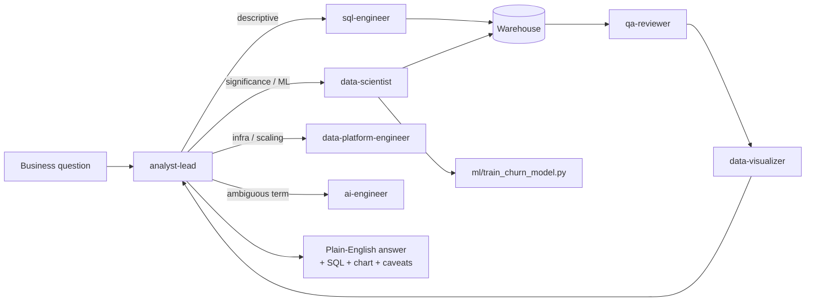

# AI Data Analyst with Claude Code

**[Live dashboard](https://ai-data-analyst-claude-code.streamlit.app/)**

> You ask a business question in plain English. A team
> of AI agents (built on Claude Code) figures out whether it needs SQL, a
> statistics test, or a machine learning model, then answers with real
> numbers, a chart, and honest caveats. No manual analysis, no clicking
> through a BI tool.

## See it work, right now

**Question:** *"Is product engagement growing or shrinking?"*
**Answer:** Weekly active users grew from 234 to 411 over 26 weeks. **Up 75.6%.**

**Question:** *"Are we healthy overall, and which accounts need attention?"*
**Answer:** Net revenue retention is **108.5%** (good). But Starter-plan
accounts churn at **28.8%** versus **6.7%** for Enterprise. A churn model then
names the specific at-risk accounts, not just the segment average.

Full write-ups with the real SQL and caveats: [`examples/example_qna.md`](examples/example_qna.md).

## What this actually is (in one picture)



You only ever talk to **one thing**: `analyst-lead`. It routes internally to
whichever specialist actually owns the question. Why split it up instead of
using one giant prompt? Because a single prompt trying to be equally good at
SQL, statistics, ML, cloud, and QA gets mushy. Splitting it is what lets one
analyst credibly cover the whole 2026 skillset without being mediocre at all
of it.

## Built with AI. Here's where I caught it being wrong.

This whole system was built using Claude Code. That's not something to hide.
It's the point. But "built with AI" only means something if you can show
where you checked its work instead of trusting it blindly.

**A real bug I caught.** The first version of the dashboard's charts rendered
bars in alphabetical order instead of the actual funnel sequence (signup,
onboarding, activation showed up as activation, funnel, signup). It looked
fine at a glance. It was wrong. I only caught it because I opened the actual
dashboard in a browser and checked every chart before calling it done. I
didn't just read the code and assume it worked. Fixed in
[`dashboard/app.py`](dashboard/app.py) with an explicit sort order.

**A result I didn't let AI oversell.** A comparison that looked like a 35%
difference in churn came back not statistically significant (p=0.075) when
actually tested. The honest answer was "promising, not proven," not "found
it." See the full example below.

**A scope call AI wouldn't have made on its own.** The project originally had
11 narrow agents, one per skill. I rejected that as unrealistic (no real
company staffs a team that way) and had it rebuilt around 7 roles that map to
actual job titles. I also cut an MLOps agent entirely because it was a
stretch past what a Data Analyst role needs, not because the code didn't
work.

That's the actual answer to "why does this need a human." Not because AI
can't write SQL. It can. It's because someone has to decide what's worth
building, verify the output is actually right, and know when a "finding"
isn't one yet. Full interview-ready version of this:
[`docs/EXPLAIN_THIS_PROJECT.md`](docs/EXPLAIN_THIS_PROJECT.md).

## Quickstart

```bash
pip install -r requirements.txt
python -m scripts.export_raw_sources
python -m pipelines.etl
```

That builds a realistic sample warehouse (fake data, real structure) modeling
a small B2B SaaS product: accounts, users, subscriptions, product usage
events. Then open this repo in Claude Code and ask a question:

- "Is product engagement growing or shrinking?"
- "Where are we losing users before they try the product?"
- "Which accounts need attention this quarter?"

More to try:

```bash
python -m experiments.ab_test          # A/B test worked example
python -m ml.train_churn_model         # train the account-health model
streamlit run dashboard/app.py         # live dashboard
pytest                                 # 24 tests, should all pass
```

## What AI automated versus what I decided

Interview guides in 2026 all ask some version of "what would you automate,
and what would you never?" Here's the honest split, using this exact project.

| AI (Claude Code) did | I decided |
|---|---|
| Wrote the SQL, Python, and dbt models | Which business questions were even worth answering |
| Drafted the agent instructions | Which agent roster actually maps to a real team (rejected the first draft) |
| Ran the stats test | Whether "not significant" should be reported honestly instead of buried |
| Built the dashboard | Whether the dashboard's chart order was actually correct (it wasn't, first try) |
| Suggested the churn model features | Whether MLOps belonged in scope at all (it didn't) |

## The team, if you want the detail

| Agent | Role | Code |
|---|---|---|
| [`analyst-lead`](.claude/agents/analyst-lead.md) | Routes the question, writes the final answer | n/a |
| [`sql-engineer`](.claude/agents/sql-engineer.md) | Schema and queries | `connectors/warehouse.py` |
| [`data-scientist`](.claude/agents/data-scientist.md) | Stats, A/B tests, ML | `stats/`, `experiments/`, `ml/` |
| [`data-visualizer`](.claude/agents/data-visualizer.md) | Charts and dashboard | `dashboard/` |
| [`data-platform-engineer`](.claude/agents/data-platform-engineer.md) | Pipelines, cloud, architecture | `pipelines/`, `infra/`, `docs/` |
| [`ai-engineer`](.claude/agents/ai-engineer.md) | Grounds fuzzy terms, agent quality | `rag/`, `knowledge/`, `evals/` |
| [`qa-reviewer`](.claude/agents/qa-reviewer.md) | Sanity checks, tests, CI | `tests/`, `.github/` |

Also in here: [`dbt/`](dbt/) (a tested semantic layer, 40/40 checks passing),
[`infra/`](infra/) (illustrative AWS/GCP/Azure Terraform, never applied to a
real account), and [`docs/ARCHITECTURE.md`](docs/ARCHITECTURE.md) (how this
would scale).

## Connecting a real warehouse

Set `DATABASE_URL` in `.env` (copy `.env.example`) to any Postgres, Snowflake,
or BigQuery connection string. Nothing else changes: every agent talks to the
warehouse only through `connectors/warehouse.py`.

## License

MIT
