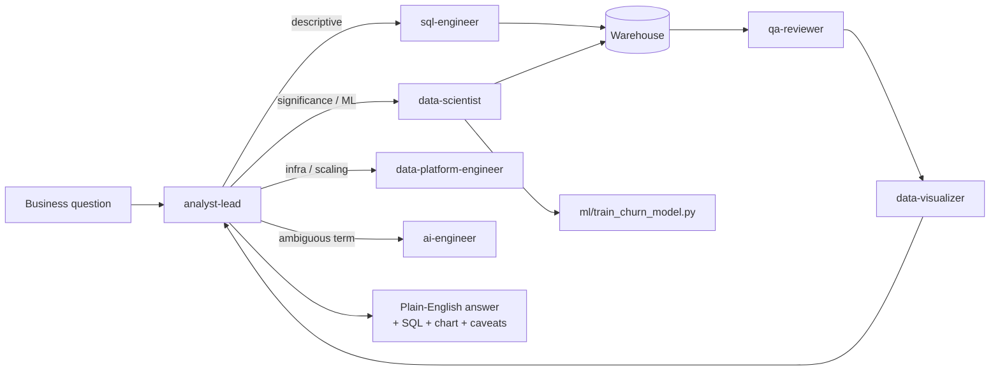

# AI Data Analyst with Claude Code

Ask a business question in plain English. Get back a real answer — backed by
actual SQL, a real chart, or a real model, with the caveats that make it
trustworthy — in the time it takes to read this sentence, not an afternoon.

This one's a deliberate departure from my other analytics projects (Power
BI/Tableau dashboards on lending, supply chain, and e-commerce data): those are
about doing the analysis by hand with BI tools. This one is about *building the
AI system that does it* — an agentic analyst, applied to the metrics that
actually run a B2B SaaS product business (engagement, activation, net revenue
retention, account health), not another BI dashboard on a transactional dataset.

## See it in action

Two real runs against the sample warehouse in this repo — full write-ups with
queries and caveats in [`examples/example_qna.md`](examples/example_qna.md).

### "Is product engagement growing or shrinking?"

**Weekly active users grew from 234 to 411 over the last 26 weeks — up 75.6%.**
One query, straight from product usage telemetry, answers a question that
otherwise means stitching together login logs by hand.

### "Are we healthy overall, and which accounts need attention this quarter?"

**Net revenue retention is 108.5%** — existing accounts are expanding faster
than they're churning, a genuinely healthy sign. But that headline hides real
variation: **Starter-plan accounts churn at 28.8% vs. 6.7% for Enterprise**, and
scoring every active account with a churn model surfaces the specific ones
worth calling — not just a segment average, a 12-seat Starter account with a
0.94 risk score. A significance test on a promising-looking pattern (does using
an integration predict retention?) comes back not-quite-significant at this
sample size — reported as "worth an experiment," not oversold as proven.

That second example needed more than a lookup — a significance test to avoid
chasing a fake pattern, and a model to find the specific accounts worth
worrying about. Answering it is what the rest of this README is about.

## What this actually is

You ask one thing — `analyst-lead` — a question, the same way you'd ask a human
analyst. Internally, it routes to whichever specialist actually owns that kind
of work, the way asking a real analytics team funnels to the right person:



That split exists for one reason: a single prompt trying to be equally good at
SQL, statistical rigor, ML, cloud architecture, and QA all at once gets mushy.
Splitting it internally is what lets *one analyst* credibly cover the full 2026
data-analyst range — SQL, statistics, A/B testing, ML, data engineering, cloud,
dashboards, LLM/RAG — without becoming a jack-of-all-trades prompt that's
mediocre at everything.

## Quickstart

```bash
pip install -r requirements.txt
python -m scripts.export_raw_sources
python -m pipelines.etl
```

This generates a realistic sample warehouse (`data/sample_warehouse.db`)
modeling a small B2B SaaS product over ~2.5 years: organizations (paying
accounts), users (seats), seat-based subscriptions, and product usage
telemetry — enough to exercise the whole system with no external credentials.

Then open this repo in Claude Code and ask a business question, e.g.:

- "Is product engagement growing or shrinking?"
- "Where are we losing users before they actually try the product?"
- "Are we healthy overall, and which accounts need attention this quarter?"
- "Does using integrations actually correlate with accounts staying longer?"

See [`examples/example_qna.md`](examples/example_qna.md) for three full runs, and
[`evals/eval_cases.md`](evals/eval_cases.md) for the golden questions used to
check answer quality as the system grows.

### Try the other pieces directly

```bash
python -m experiments.ab_test          # A/B readout worked example
python -m ml.train_churn_model         # train the account-health model
python -m rag.retrieve                 # glossary grounding worked example
streamlit run dashboard/app.py         # live dashboard
pytest                                 # full test suite

# semantic layer (separate install — see dbt/README.md)
pip install -r dbt/requirements.txt
cd dbt && DBT_PROFILES_DIR=$(pwd) dbt build
```

## Under the hood: how the work is split

One agent per real team role, not one per individual skill — so an ML question
doesn't get answered by the same prompt that writes SQL, but you never have to
know or care which one you're "talking to":

| Agent | Covers | Backing code |
|---|---|---|
| [`analyst-lead`](.claude/agents/analyst-lead.md) | Understands the question, routes it, synthesizes the answer | — |
| [`sql-engineer`](.claude/agents/sql-engineer.md) | Schema discovery, query writing | `connectors/warehouse.py` |
| [`data-scientist`](.claude/agents/data-scientist.md) | Statistics, A/B test readouts, predictive modeling | `stats/`, `experiments/`, `ml/train_churn_model.py` |
| [`data-visualizer`](.claude/agents/data-visualizer.md) | Ad-hoc charts and the standing dashboard | `dashboard/` |
| [`data-platform-engineer`](.claude/agents/data-platform-engineer.md) | Pipelines, data quality, cloud deployment, system design | `pipelines/`, `infra/`, `docs/ARCHITECTURE.md` |
| [`ai-engineer`](.claude/agents/ai-engineer.md) | Grounding ambiguous metric definitions, agent/skill quality | `rag/`, `knowledge/`, `evals/` |
| [`qa-reviewer`](.claude/agents/qa-reviewer.md) | Per-answer sanity checks, test suite, CI | `tests/`, `.github/workflows/ci.yml` |

`.claude/skills/` holds the reusable playbooks these agents follow: schema
exploration, growth metrics (engagement + revenue retention), cohort retention,
funnel analysis, anomaly detection, executive-summary formatting.

- **[`dbt/`](dbt/)** — a parallel, tested semantic layer: the same
  transform/metric logic as `pipelines/etl.py`, expressed as governed dbt
  models instead (`dbt build` seeds, runs, and tests 40/40 checks against the
  same sample data, and its outputs match the Python pipeline's numbers
  exactly). Not wired into the agent-facing warehouse today — see
  [`dbt/README.md`](dbt/README.md) for why it's kept separate.

- **`connectors/warehouse.py`** — the one place all SQL goes through. Read-only
  by construction (rejects anything but `SELECT`/`WITH`/`EXPLAIN`). Defaults to
  the local sample warehouse; point `DATABASE_URL` at Postgres/Snowflake/BigQuery
  to run against a real one with no agent/skill changes — see
  [`docs/cloud-deployment.md`](docs/cloud-deployment.md).
- **`infra/` + `docs/`** — illustrative Terraform for AWS/GCP/Azure and
  [`docs/ARCHITECTURE.md`](docs/ARCHITECTURE.md) covering security, observability,
  and scaling — documentation and IaC only, nothing applied against a live
  account.

## Connecting a real warehouse

Copy `.env.example` to `.env` and set `DATABASE_URL` to your warehouse's
SQLAlchemy connection string. Nothing else changes: every agent, skill,
pipeline, and the dashboard talk to the warehouse only through
`connectors/warehouse.py`.

## Why this instead of a fixed dashboard

A BI dashboard answers the questions it was built to answer. This answers the
question that actually gets asked — including the follow-up ("okay, now break
that down by region," "is that actually significant?") — because it knows *how
to investigate*, not just which chart to draw. The tradeoff: it needs guardrails
(read-only queries, mandatory QA, explicit caveats, a real test suite) so
flexibility doesn't come at the cost of trustworthy numbers — see the ground
rules in [`CLAUDE.md`](CLAUDE.md).

## License

MIT
