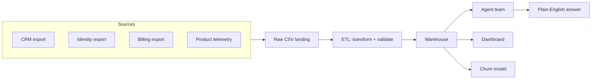

# System architecture

This documents how the system is architected today, and how `data-platform-engineer`
would evolve it for production scale, kept explicitly separate so it's clear what's
implemented versus planned (see the callouts on each section).

## Data flow

Sources land in `data/raw/*.csv` untouched, `pipelines/etl.py` transforms and
validates them, and the result lands in the warehouse via
`connectors/warehouse.py`, which the agent team (`.claude/agents/`), the
dashboard (`dashboard/app.py`), and the churn model
(`ml/train_churn_model.py`) all read from.

**Implemented:** everything above, against the local SQLite sample warehouse.
**Planned for scale:** the "Sources" boxes are simulated by
`scripts/export_raw_sources.py` today; a real deployment replaces them with actual
CRM/identity-provider/billing/product-telemetry exports (batch files or a
streaming source) landing in the same `data/raw/` (or an object-store
equivalent, S3/GCS/Blob) pattern.

## Security

- **Least-privilege database access.** The connection `DATABASE_URL` points agents
  at should be a read-only database role. `connectors/warehouse.py`'s statement
  guard (rejecting anything but `SELECT`/`WITH`/`EXPLAIN`) is a second layer, not a
  substitute for enforcing this at the database level.
- **Secrets never in code.** Connection strings live in the cloud's secret manager
  (see `docs/cloud-deployment.md`), referenced by the deployment config, never
  committed or hardcoded.
- **PII handling.** The sample warehouse's `users.email`/`name` are synthetic.
  A real deployment should decide, per column, whether an analyst-facing agent
  needs raw PII or a masked/tokenized version, this is a data-platform-engineer
  decision made per-source, not something the agent layer should have to reason
  about at query time.

## Observability

*Planned, not yet implemented in this repo:*

- **Query logging.** Every SQL statement `connectors/warehouse.py` runs, logged
  with a timestamp and the question that prompted it, makes "why did the agent say
  X" answerable after the fact.
- **Agent action audit log.** Which agent ran, what it delegated to, what it
  returned, useful both for debugging a bad answer and for the `ai-engineer`
  eval process in `evals/eval_cases.md`.

## Scaling agent orchestration

Today, one question runs through one `analyst-lead` invocation synchronously. At
higher concurrency (many stakeholders asking questions at once), the failure mode
to design around is redundant work, not correctness:

- **Cache identical/near-identical queries.** Two stakeholders asking about "last
  month's revenue" an hour apart shouldn't both trigger a fresh warehouse query and
  a fresh chart render, a short-TTL cache keyed on the normalized question (or the
  resolved SQL) avoids that.
- **Queue long-running analysis.** A question that needs `data-scientist` to train
  or score a model shouldn't block on the same synchronous path as a simple
  `sql-engineer` lookup, route heavier work through a queue so the two don't
  compete for the same latency budget.
- **Stateless agents, stateful warehouse.** Agents themselves hold no state between
  questions (session context aside), all durable state is the warehouse, which is
  what makes horizontal scaling of the "many stakeholders asking at once" case
  straightforward: add capacity, don't shard state.

## What's explicitly out of scope

A hosted "ask the analyst" API/chat product for non-technical stakeholders is a
reasonable next step but isn't built here, this repo is the analyst team itself
(agents + skills + data), meant to be used from within Claude Code. Wrapping it in
a stakeholder-facing product would mean adding an API layer, auth, and the caching/
queueing above; it would not change how the agents or pipeline work underneath it.
