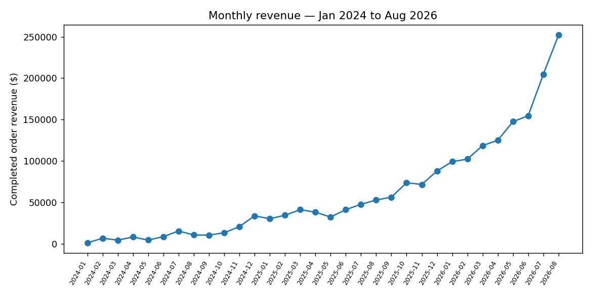

# Example session

This is a real run against the warehouse produced by the
`scripts/export_raw_sources.py` → `pipelines/etl.py` pipeline, using the
`analyst-lead` agent and `revenue-trend-analysis` skill.

## Question

> "How has revenue been trending over the last few months, and is growth
> accelerating or slowing?"

## Answer

**Revenue grew 23.1% month-over-month in August 2026, the fastest growth rate in the
last six months** — growth has been accelerating each month since April, not slowing.

**Why it matters:** this isn't a one-off spike; the acceleration has held for four
consecutive months (April → Aug), which is worth understanding before planning
capacity/hiring against a flatter forecast.

**Evidence:**

| Month | Revenue |
|---|---|
| 2026-03 | $118,503.53 |
| 2026-04 | $125,044.31 |
| 2026-05 | $147,408.54 |
| 2026-06 | $154,633.30 |
| 2026-07 | $204,715.98 |
| 2026-08 | $252,104.59 |



**Query used:**

```sql
WITH monthly AS (
  SELECT strftime('%Y-%m', order_date) AS month, SUM(total_amount) AS revenue
  FROM orders
  WHERE status = 'completed'
  GROUP BY 1
)
SELECT * FROM monthly ORDER BY month;
```

Revenue is defined as gross value of `completed` orders (`orders.total_amount`),
excluding `refunded`/`cancelled` orders.

**Caveats:** September 2026 is a partial month in the source data and was excluded
from the trend to avoid reading a false drop-off. Sample size per month (a few
hundred orders) is small enough that a handful of large orders can meaningfully move
the MoM number — see `.claude/skills/anomaly-detection.md` for how the QA pass
checks for that.
