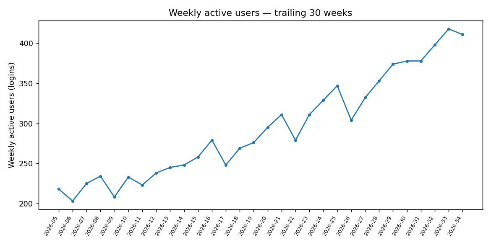

# Example sessions

Three real runs against the warehouse produced by
`scripts/export_raw_sources.py` → `pipelines/etl.py`, ordered from simplest to
most involved. Each one is a question you'd actually ask a data/product analyst
at a B2B SaaS company, answered by actually running the agents/skills against
real data, not a mocked-up example.

---

## 1. "Is product engagement growing or shrinking?"

*Agents: `analyst-lead` + `sql-engineer`, skill: `growth-metrics-analysis`.*

**Weekly active users grew from 234 to 411 over the last 26 weeks, up 75.6%.**
Engagement is trending up, not flattening or declining.



**Query used:**

```sql
SELECT strftime('%Y-%W', event_date) AS week, COUNT(DISTINCT user_id) AS wau
FROM product_events
WHERE event_type = 'login'
GROUP BY 1
ORDER BY 1;
```

**Caveats:** the most recent week in the raw data is partial and was excluded
from the trend to avoid reading a false drop-off, see
`.claude/skills/growth-metrics-analysis.md`.

---

## 2. "Where are we losing users before they actually try the product?"

*Agents: `analyst-lead` + `sql-engineer`, skill: `funnel-analysis`.*

Of 3,206 users who signed up, only 1,421 (44%) ever activated (created a
project, the point where they've gone beyond onboarding and touched the core
feature).

| Stage | Users | Drop from previous stage |
|---|---|---|
| Signed up | 3,206 |, |
| Completed onboarding | 2,295 | lost 911 (28%) |
| Activated (created a project) | 1,421 | lost 874 (**38%**) |

**Why it matters:** the biggest leak is after onboarding, not during it, users
who finish the guided setup still don't reach the feature that makes the product
useful. Accounts where fewer users activate also run a few points hotter on
churn (46% vs. 42% average activation rate, active vs. churned accounts), a
real but modest signal, not a dramatic one, so it's reported as suggestive
rather than proof that fixing activation alone would fix churn.

**Query used:**

```sql
SELECT event_type, COUNT(DISTINCT user_id) AS users
FROM product_events
WHERE event_type IN ('signup', 'completed_onboarding', 'created_project')
GROUP BY event_type;
```

**Caveats:** this counts everyone who *has* reached each stage, not a cohort
followed over a fixed window, a user who signed up last week hasn't had as
much time to activate yet, so very recent signups slightly understate the true
eventual conversion rate.

---

## 3. "Are we healthy overall, and which accounts need attention this quarter?"

*Agents: `analyst-lead` → `data-scientist` (stats + ML), skill: `executive-summary`.*

This one needed more than a lookup, a significance test and a model, not just
a query, to show what "wears multiple hats" looks like in practice.

**Net revenue retention is 108.5%** among established accounts, expansion from
existing accounts is outpacing churn and contraction combined, a healthy sign
for a growing SaaS business. But that headline number hides real variation:
**Starter-plan accounts churn at 28.8%, versus 6.7% for Enterprise**, the
self-serve tier is where the risk actually concentrates.

Does adopting an integration explain some of that difference? Accounts that
never used an integration churned at 27.1%, versus 17.5% for accounts that did,
a meaningful-looking 35% relative gap. But a two-proportion significance test
comes back **p = 0.075, not quite significant at this sample size**
(the no-integration group is only 59 accounts). Read as: promising, worth a
real experiment before rolling out an integration-adoption push as an official
retention strategy, not yet confirmed.

What *is* actionable now: scoring every active account with the churn model
surfaces specific accounts to prioritize, not just a segment average, e.g. a
12-seat Starter-plan Finance account with a 0.94 churn-risk score, several
points higher than the segment's own average.

**Method:** `sql-engineer` pulled plan-tier churn and NRR;
`experiments/ab_test.py`'s two-proportion z-test checked the integration
comparison; `ml/train_churn_model.py`'s classifier (built on engagement
features, feature-adoption breadth, days since last login, not just plan/seat
count) scored every active account.

**Caveats:** the churn model's accuracy is modest (AUC ~0.65–0.67 depending on
training run), good enough to rank relative risk and target outreach, not
good enough to treat any single account's score as certain. The integration
z-test is underpowered, so "not significant" here means "not yet confirmed,"
not "proven to have no effect."
